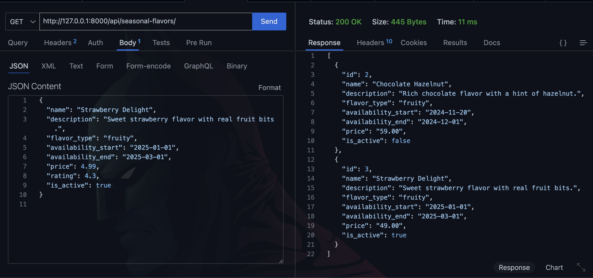
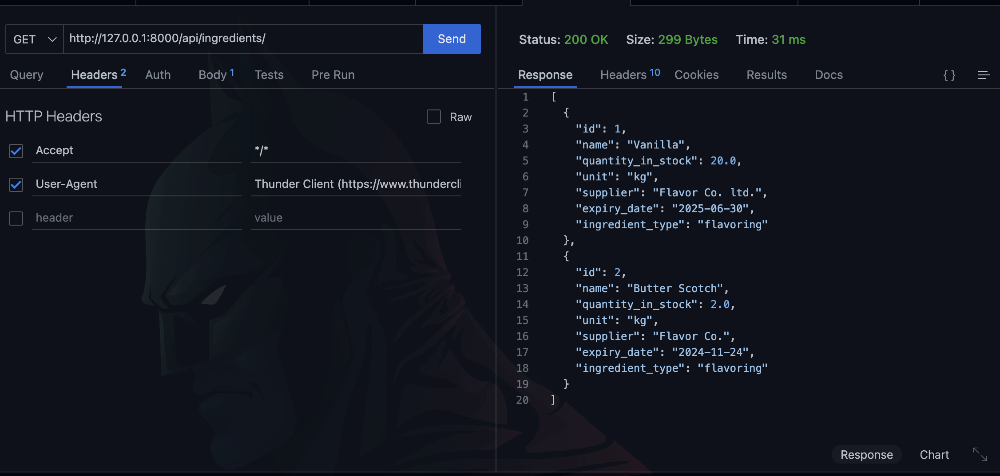
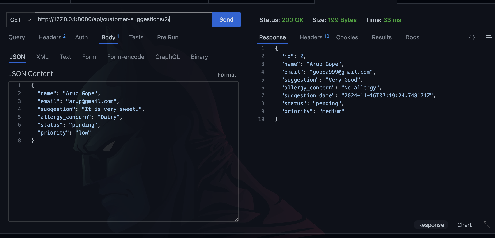
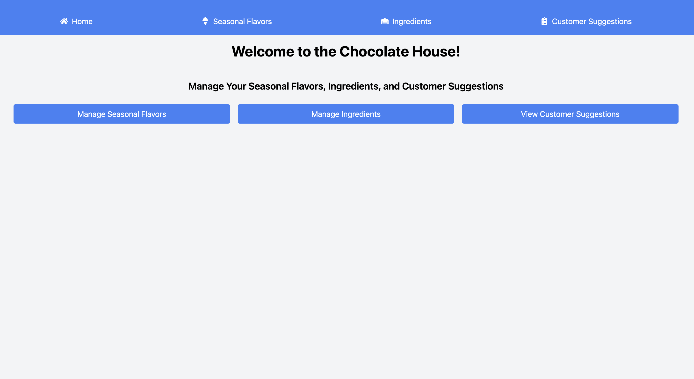
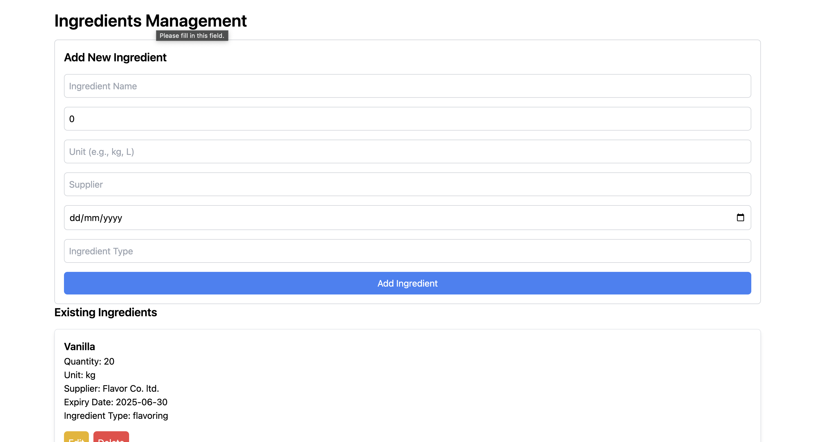
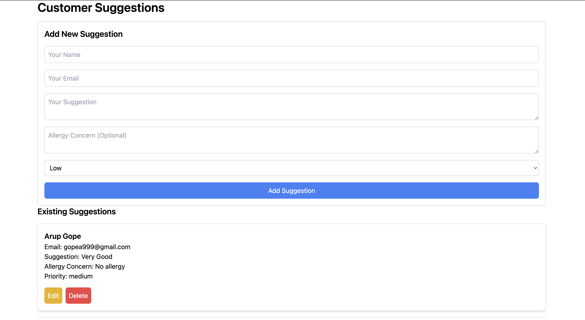

# L7 Informatics Python Problem Assignment

A simple Python Application for a fictional chocolate house using Django Rest Framework and ReactJs with Tailwind Css. <br/>

## Backend (DRF+sqlLite)

### API Endpoints:
default run on ``` http://127.0.0.1:8000/ ``` <br/><br/>

#### 1. Seasonal API

```api/seasonal-flavors/ ``` <br/>
GET: to get all items<br/>
GET/{id}: to get one element in specific id
```api/seasonal-flavors/2/ ``` <br/>
POST: To create  <br/>

sample data:

```bash
{
  "name": "Strawberry Delight",
  "description": "Sweet strawberry flavor with real fruit bits.",
  "flavor_type": "fruity",
  "availability_start": "2025-01-01",
  "availability_end": "2025-03-01",
  "price": 4.99,
  "rating": 4.3,
  "is_active": true
}

```
PUT or PATCH /{id}: to update data 

DELETE/{id}: to Delete item


#### 2. Ingredients API

```api/ingredients/ ``` <br/><br/>

GET: to get all items<br/>
GET/{id}: to get one element in specific id
```api/ingredients/2/ ``` <br/>
POST: To create  <br/>

sample data:

```bash
{
  "name": "Vanilla",
  "quantity_in_stock": 200.0,
  "unit": "grams",
  "supplier": "Flavor Co.",
  "expiry_date": "2025-06-30",
  "ingredient_type": "flavoring"
}


```
PUT or PATCH /{id}: to update data  <br/>

DELETE/{id}: to Delete item <br/>


#### 3. Customer Suggestions API

```api/customer-suggestions/ ``` <br/><br/>
GET: to get all items<br/>
GET/{id}: to get one element in specific id
```api/customer-suggestions/2/ ``` <br/>
POST: To create  <br/>

sample data:

```bash
{
  "name": "Arup Gope",
  "email": "arup@gmail.com",
  "suggestion": "It is very sweet.",
  "allergy_concern": "Dairy",
  "status": "pending",
  "priority": "low"
}

```
PUT or PATCH /<id> : to update data  <br/>

DELETE/<id>: to Delete item <br/>

### Bellow images 








## Frontend (React+Vite+Tailwind Css)

I have created a minimum frontend for the project with Home Page, Seasonal Flavors page, Ingredients page and Customer Suggestion page.Bellow the images are mentioned.

 




## How to use the project:

fork and clone the repo: 
```bash
 git clone https://github.com/arup1221/L7-Informatics-Task.git
```
then create go to the L7-Informatics-Task directory and create Virtual Environment:

```bash
python -m venv env
```

activate it <br/>

MacOs
```bash
source env/bin/activate
```
Windows

```bash
env\Scripts\activate
```

Then
```bash
cd chocolate_house
pip install -r requirements.txt
```

Then run the backend Server:
```bash
python manage.py runserver
```

then go to the Forntend and install dependecy(using `npm i` or `yarn` or `bun install` commands) and run react server

```bash
cd ..
cd frontend
npm install
npm run dev
```

then 2 apps runnings in `localhost:8000` Backend and `localhost:5173` the Frontend.

## Using Docker

### Manually 

Pull the backend image
```bash
docker pull arup1221/chocolate-backend
```

Run the backend container
```bash
docker run -d -p 8000:8000 arup1221/chocolate-backend
```


Pull the Frontend image
```bash
docker pull arup1221/chocolate-frontend
```

Run the Frontend container
```bash
docker run -d -p 5173:5173 arup1221/chocolate-frontend
```

and the 2 apps runnings in `localhost:8000` Backend and `localhost:5173` the Frontend.


### Automatic 

Fork and clone the repo 

```bash
 git clone https://github.com/arup1221/L7-Informatics-Task.git
```

then go to the L7-Informatics-Task

```bash
cd L7-Informatics-Task
```

Then Start both containers 

```bash
docker-compose up -d
```

To stop and remove containers

```bash
docker stop <container_id>
docker rm <container_id>
```
